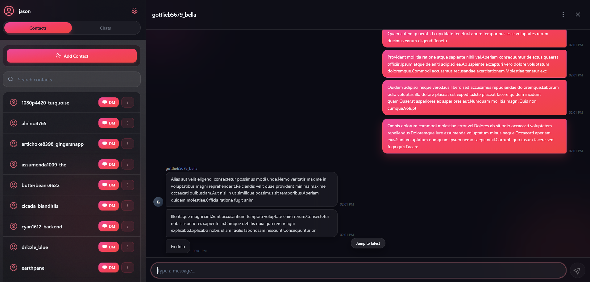

# CocaTalk

> Archived — this project has been discontinued in favor of a fresh rebuild, **CacoTalk**.

CocaTalk was my first serious attempt at building a full-stack real-time messaging application.

The project grew far, far beyond its original scope and eventually reached a point where maintaining and extending it became unnecessarily difficult. After taking a hiatus, I decided that continuing to patch the existing architecture would teach me less than starting again with a clearer, simpler design.

## Project Status

Before development was discontinued, CocaTalk had reached a functional state with several core messaging features implemented and tested.

### Implemented

* JWT-based authentication
* Contact management
* User blocking
* Direct messaging
* Group chats
* Real-time messaging over WebSockets
* WebSocket disconnection detection
* Connection reconciliation after reconnecting
* Infinite-scroll message pagination
* Persistent message history
* Functional frontend UI for messaging and conversation management

Both direct messaging and group chat functionality were working and tested before the project was archived.

### Not Implemented

The following planned features were not completed:

* Muting conversations
* Group membership management

  * Inviting users to an existing group
  * Removing users from a group

Development stopped before these features were added, as I decided to rebuild the project with a simpler and more maintainable architecture rather than continuing to expand the existing codebase.

## Successor

Development continues in **CacoTalk**, a clean-sheet successor built using the lessons learned here.

**Status:** Archived
**Successor:** CacoTalk
**Purpose of this repository:** Historical project / learning record
